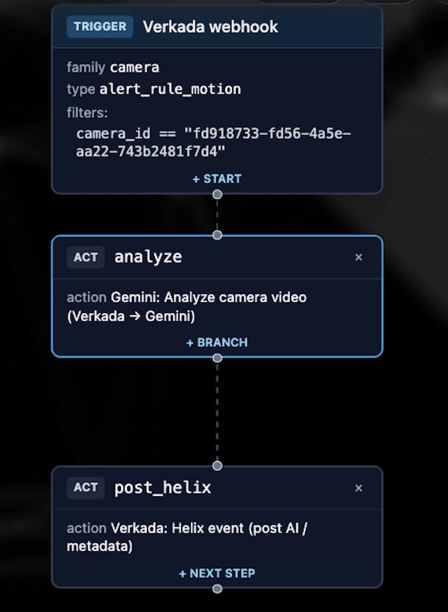
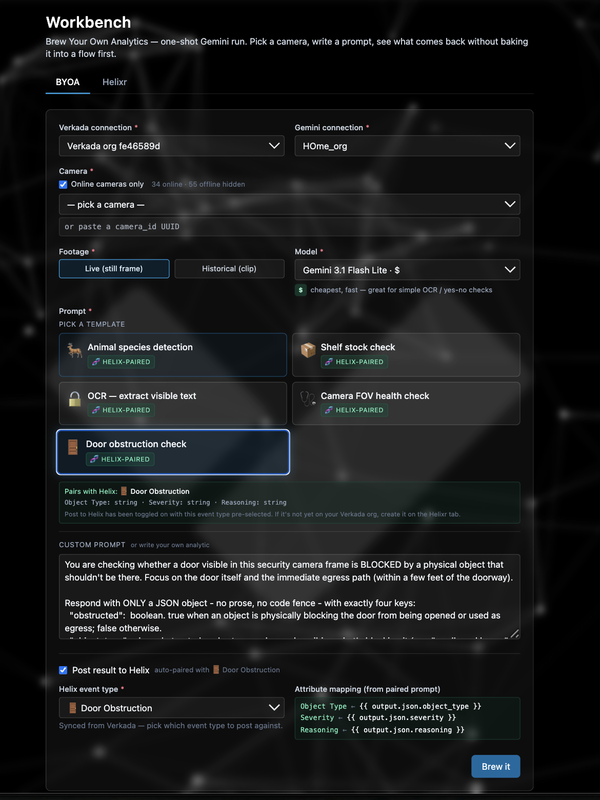
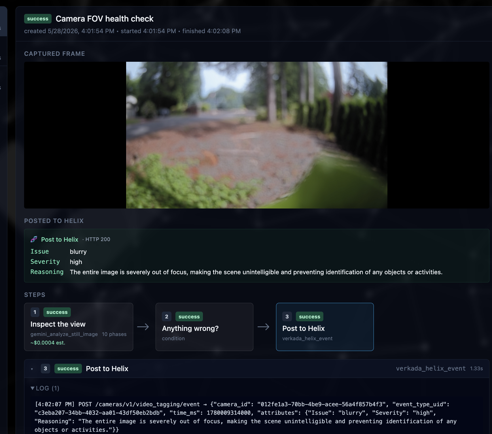
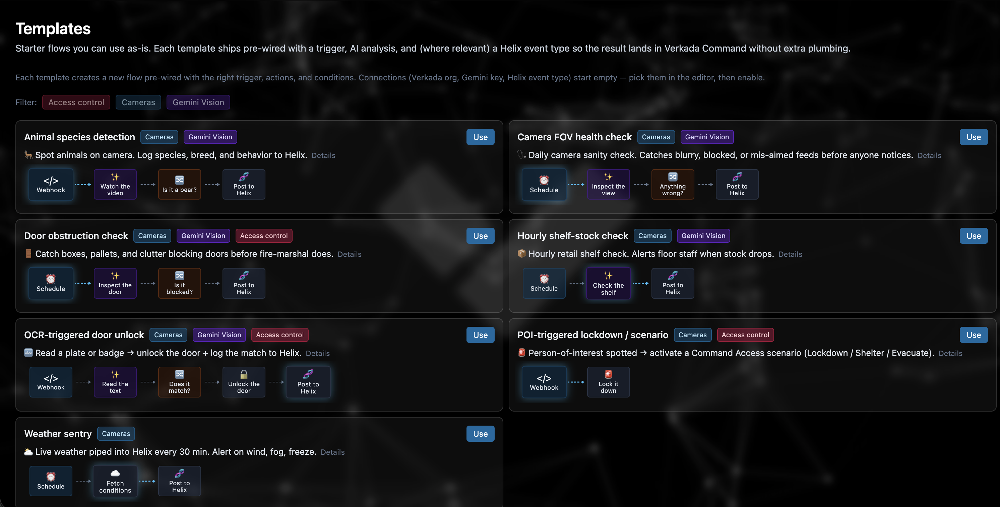
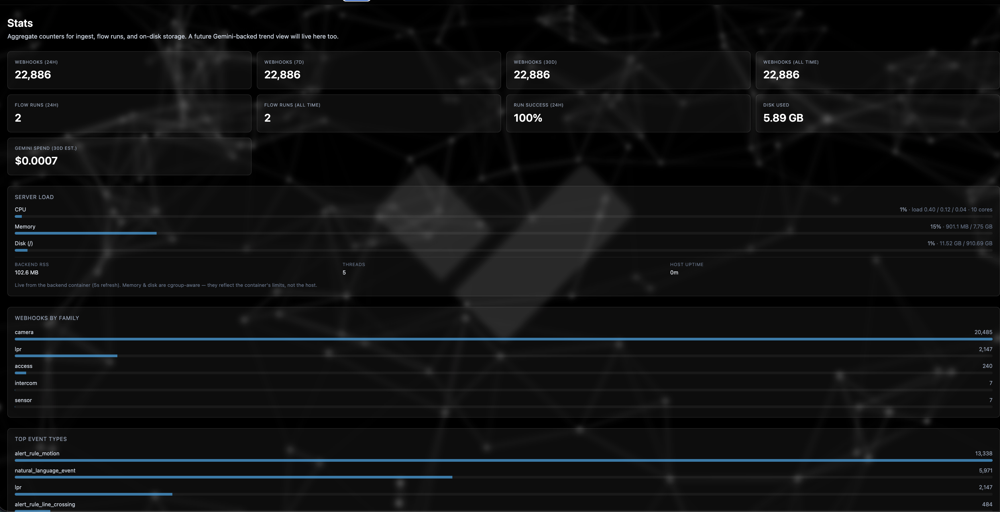
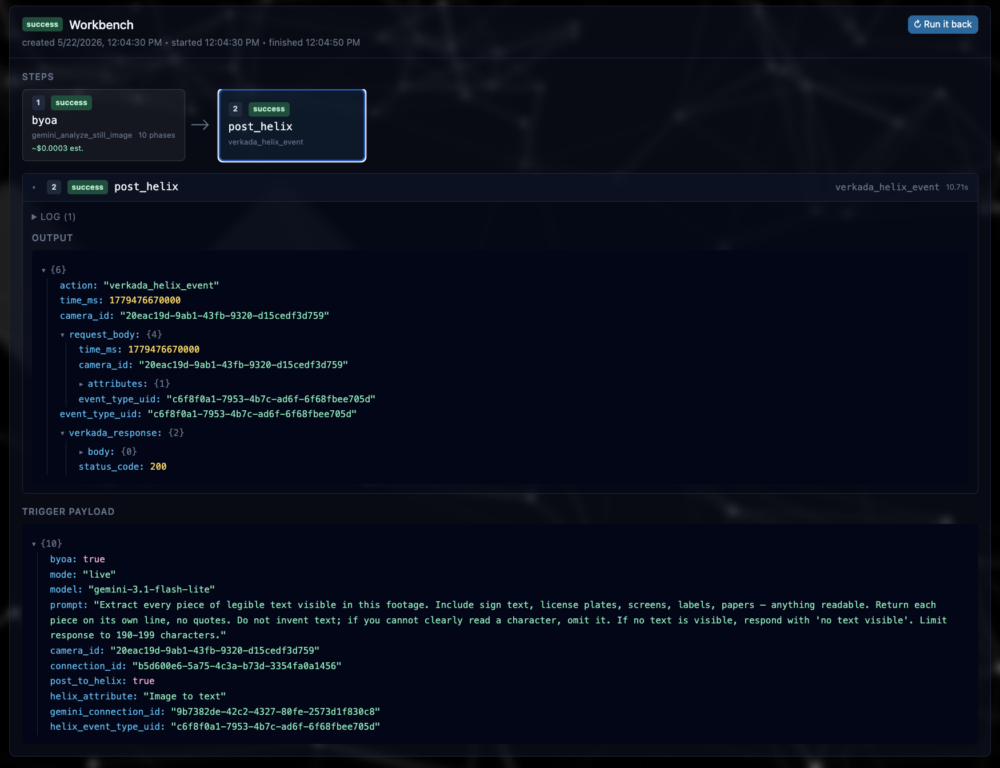
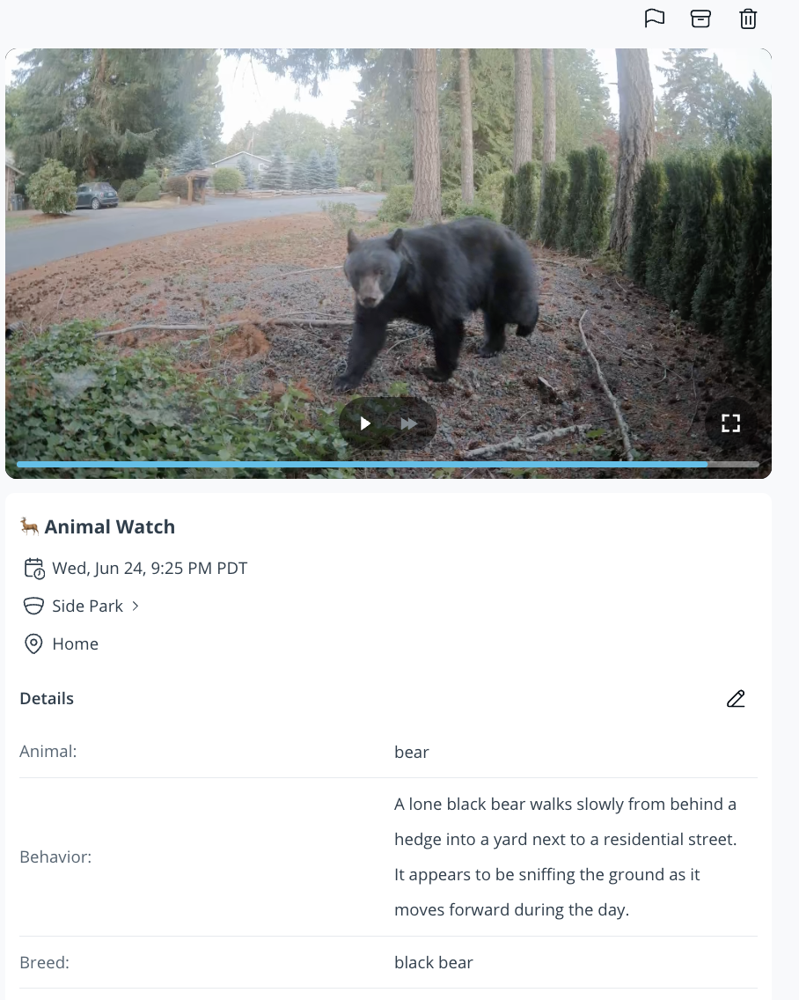
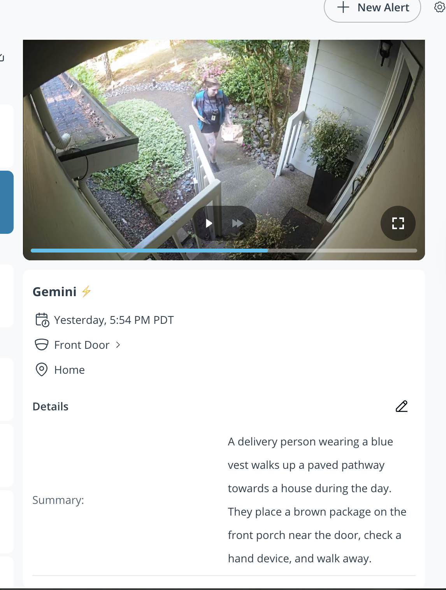
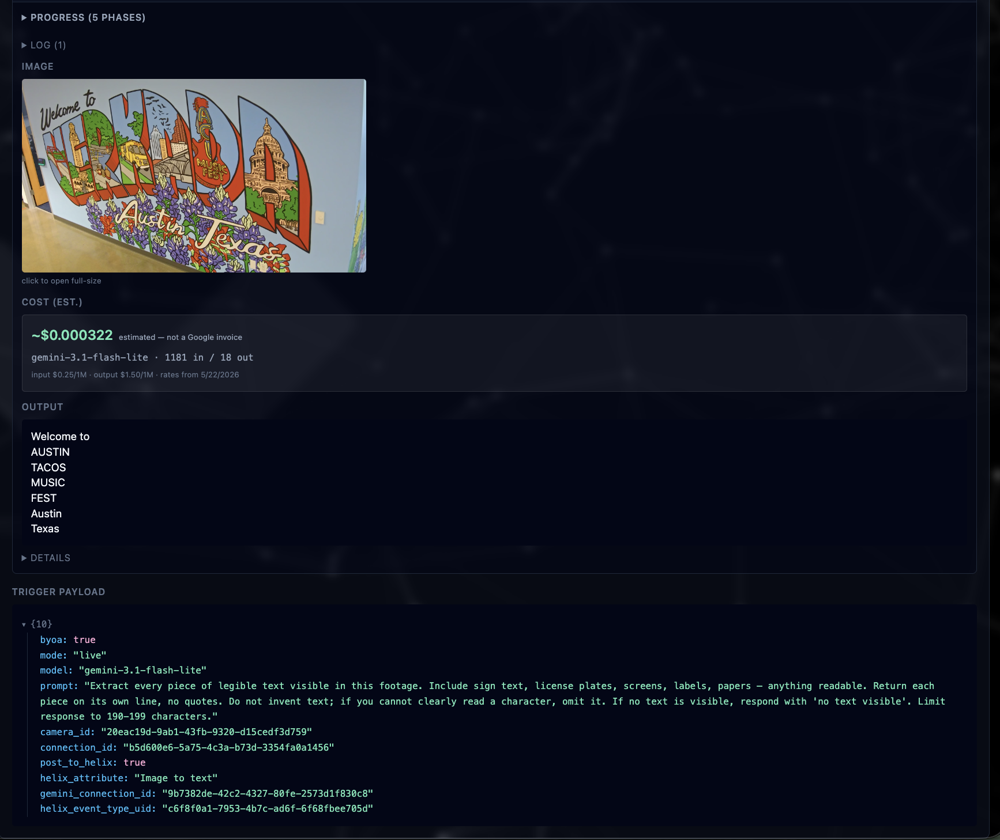
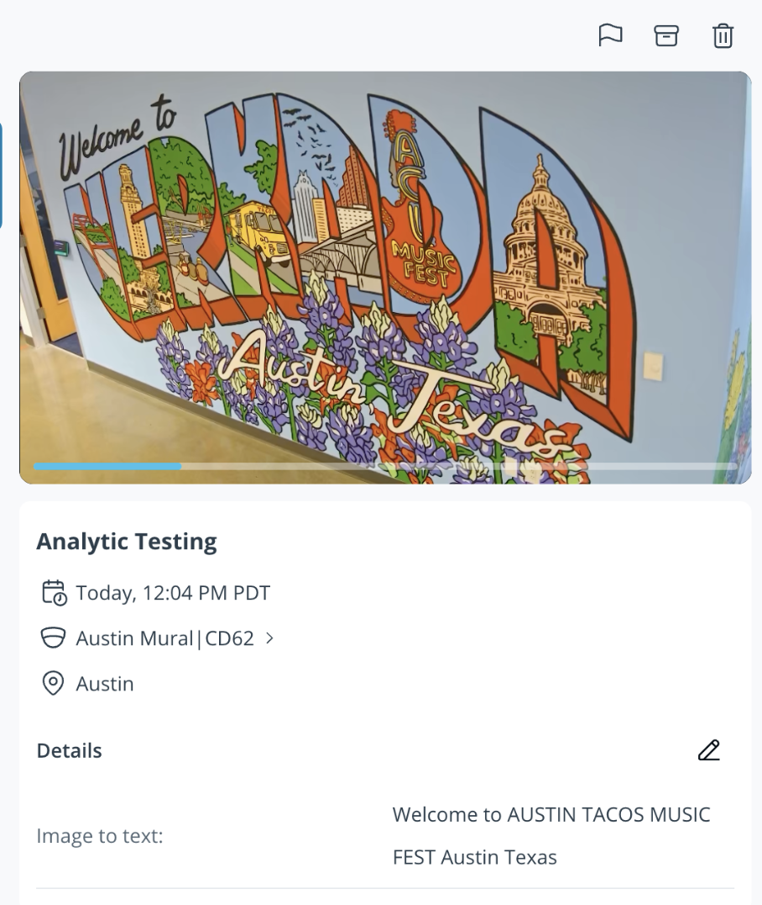

# vFusion

⚠️ **Beta — built by a Verkada SE, not an official Verkada product.** Expect breaking changes. No warranty; see [LICENSE](LICENSE). This tool can unlock doors and pull camera footage — read **[Before you deploy](#before-you-deploy)** first.

Interacting with Verkada webhooks and APIs have never been easier with this tool. Fuse together custom pipelines that allow you to push Verkada's API to its full potential. 

Self-hosted, Verkada-flavored workflow automation — a visual router for webhooks and API events. Think Zapier/n8/make.com, but built around the Verkada API surface.

📸 **[Jump to screenshots →](#screenshots)**

## Features

- 📥 **Webhook inbox** — catch any Verkada webhook at `/hooks/*`, auto-classify into family (camera / access / lpr / sensor / intercom), auto-detect new orgs on first sight
- 🎨 **Visual flow editor** — drag-and-drop canvas (React Flow) for event-driven automations. Conditions, branches, per-step ▶ Run button for testing
- 🎥 **Gemini video analysis** — pull a historical clip from any Verkada camera at trigger time, send to Gemini (2.5 / 3.x Flash or Pro), get AI summary back. Or analyze a single live frame for ~10× cost savings
- 🚪 **Verkada actions** — unlock doors, post Helix events (schema-aware attribute validation), or call any cataloged endpoint generically
- 📚 **API catalog** — auto-syncs every Verkada OpenAPI spec every 4 hours, generates structured request forms for path / query / body params on every endpoint
- ⏰ **Triggers** — Verkada webhooks + scheduled jobs (interval / daily / weekly)
- 🧪 **Workbench** — one-shot Gemini test page. Pick a camera, write a prompt, optionally chain a Helix post — without building a full flow first. "Run it back" to rehydrate any past test
- 📊 **Stats & cost** — ingest counters (24h / 7d / 30d), top event types with inbox drill-down, Gemini spend tracking per model, real-time server load (CPU / memory / disk)
- 🌍 **Public URLs built-in** — two deploy modes: quick mode (free TryCloudflare URL, zero Cloudflare setup) and production (named tunnel on your own domain). URL auto-displayed in the UI banner
- 🔐 **Secrets at rest** — Fernet encryption for stored API keys + signing secrets, HMAC webhook signature verification, sensitive headers redacted before persistence

## Example use cases

A few flows you can build with vFusion's core loop — **trigger → Gemini → Helix event in Verkada Command**:

| Use case | Trigger | What the flow does |
|---|---|---|
| **Animal detection alerts** | Motion webhook from a wildlife camera | Gemini identifies the animal, posts it to Helix as `Animal`. Command alerts when `Animal` contains "bear". |
| **Hourly shelf-stock check** | Hourly schedule | Gemini scores shelf fullness 0–100, posts to Helix as `Stock Level`. Command alerts floor staff when below 30. |
| **POI-triggered lockdown** | Verkada POI webhook | Optional watchlist filter, then `verkada_api_call` hits the door-lockdown endpoint from the API catalog. |

## Before you deploy

This tool can unlock doors, pull live and historical camera footage, post events into Verkada Helix, and call any Verkada API endpoint your key allows. Treat it like the production system it talks to:

- **Scope your Verkada API key to least privilege.** Only grant permissions for actions your flows actually need — e.g. if you only want Gemini analytics, do **not** grant door control. The key is encrypted at rest, but a tighter scope is a smaller blast radius if a key leaks or a flow misfires.
- **Don't expose the dashboard or backend API to the public internet.** A single-password login gates them (set during first-run setup), but it's basic — no MFA, no rate-limit, no IP allow-list. Treat it as one layer; bind these ports to LAN/localhost and use **Tailscale** or a VPN for remote access. The only thing meant to face the internet is `POST /hooks/verkada`.
- **Always set a webhook signing secret.** Without it, anyone who knows your public `/hooks/verkada` URL can forge events — which may trigger real actions (a door-unlock flow, a Helix post on the wrong camera).
- **Cap your Gemini API spend.** Set a daily/monthly budget alert in [Google AI Studio](https://aistudio.google.com/) so a runaway flow (or a noisy webhook source) can't surprise you with a bill. vFusion's Stats page shows an *estimate* — Google's billing is the source of truth.
- **Back up the `vfusion_secrets` docker volume.** It holds the Fernet master key that encrypts every stored credential. Losing it = losing all of them.
- **Run on infrastructure you control.** Review the code first. Don't point this at production orgs you can't afford to debug.

## Requirements

Line these up before you start. Docker is the only thing you install on the host — Postgres, Redis, Python, Node, and ffmpeg all run inside containers.

### Required

- **A host to run it on** — Linux, macOS, or Windows. Run it always-on for 24/7 webhook capture, or spin it up just for a demo / test session and tear it back down — either works.
- **Docker Desktop** (or Docker Engine + Compose v2). Verify with `docker --version` and `docker compose version`.
- **A Verkada Command organization** with admin access — needed to create the webhook (Admin → API & Integrations → Webhooks) and to generate an API key.
- **A Verkada API key** — generated in Verkada Command. Used to pull camera footage, post Helix events, unlock doors, and call catalog endpoints.

> ⚠️ **Scope the key to least privilege.** A Verkada API key only grants the permissions you pick when you create it. Give vFusion access to exactly what your flows need — and nothing more. For example, if you only want Gemini analysis of camera footage, grant camera/footage access but **not** door control. The key is stored encrypted at rest, but a tighter scope is a smaller blast radius if a key ever leaks or a flow misfires.

### Optional — needed for specific features

- **A Google Gemini API key** — free to create at [aistudio.google.com](https://aistudio.google.com/). Required only for the Gemini video / still-image analysis actions and the Workbench. Flows that just post Helix events, unlock doors, or call generic API endpoints don't need it. Gemini usage is billed by Google; vFusion tracks an estimated cost.
- **A Cloudflare account + a domain on Cloudflare** — only for **production mode** (a stable webhook URL on your own domain). **Quick mode** needs neither — it uses a free, ephemeral TryCloudflare URL.
- **Tailscale or a VPN** — recommended for remote admin access. The dashboard and admin API have no built-in auth, so don't expose them to the public internet.

## Two ways to run

| Mode | Webhook URL | Best for |
|---|---|---|
| **Quick** | `https://<random>.trycloudflare.com/hooks/verkada` — changes on every restart | Testing, demos, kicking the tires. No Cloudflare account or domain needed. |
| **Production** | `https://hooks.yourdomain.com/hooks/verkada` — stable | Always-on deploys. Requires a free Cloudflare account + a domain on Cloudflare. |

Both share the same bootstrap below. After that, pick one path.

---

## Bootstrap (one-time, ~5 min)

Same for both modes. If you're skipping ahead to Production, do these steps first.

### 1. Install Docker Desktop

Download from [docker.com/products/docker-desktop](https://www.docker.com/products/docker-desktop/) (free for personal / small-business use). Open the app once after install to start the engine.

Verify:
```bash
docker --version
docker compose version
```

### 2. Clone and copy the env template

```bash
cd ~
git clone https://github.com/PacketTrace/vFusion.git
cd vFusion
cp .env.example .env
```

That's it for setup. The encryption key (`FERNET_KEY`) generates itself on first backend boot and persists in the `vfusion_secrets` docker volume — you don't have to run anything. If you'd rather manage the key yourself (e.g. via 1Password), drop it into `.env` before starting the stack.

> ⚠ **Back up the `vfusion_secrets` volume.** It holds the master key that encrypts every stored API key and signing secret. Losing it = losing all your stored credentials. `docker run --rm -v vfusion_secrets:/src -v $PWD:/dst alpine tar czf /dst/vfusion-secrets-backup.tar.gz -C /src .` exports it to a tarball.

---

## Quick mode — testing & demos

For trying the full Verkada → webhook → flow loop without configuring a domain. Cloudflare hands you a random `https://<random-words>.trycloudflare.com` URL.

### 1. Start the stack

```bash
docker compose --profile quick up --build -d
```

First build takes ~2–3 min (image pulls + npm install + alembic migrations). Subsequent starts are seconds. Then open **http://localhost:15173** — the inbox banner shows your trycloudflare URL within ~10 seconds.

### 2. Wire it into Verkada Command

Open **http://localhost:15173**. On first run you'll be asked to set an **admin password** (single user, hashed with bcrypt — write it down, there's no email recovery). Then the welcome modal walks you through wiring up the webhook — both the **Generate signing secret** button and your public webhook URL live right in the modal. The signing secret is what lets vFusion verify each inbound webhook actually came from your org (both sides compute HMAC-SHA256 against the same string). **Strongly recommended even in quick mode** — without it, anyone who finds your trycloudflare URL could forge events.

1. **In the vFusion welcome modal** → click **Generate signing secret** → click **Copy**.
2. **Verkada Command** → **Admin** → **API & Integrations** → **Webhooks** → **Add**:
   - **Endpoint URL**: copy the trycloudflare URL from the welcome modal (it already includes `/hooks/verkada`)
   - **Shared secret**: paste the string you just generated
   - Pick the notification types you want
   - **Save**
3. **In Verkada Command** → click **Send test webhook**.

The dashboard auto-unlocks the moment the real webhook arrives — vFusion auto-detects the org and creates a Connection for it. In the inbox, the event should show a green **✓ verified** badge. To finish, head to **Connections**, open the auto-created Verkada org, and paste in your **Verkada API key** so the action steps can act on cameras, doors, and Helix.

### What's exposed through the tunnel

Only the exact path `POST /hooks/verkada`. A Caddy reverse proxy sits between the trycloudflare URL and the backend and returns 404 for anything else (admin API, dashboard, synthetic slugs, wrong HTTP methods). So even if the URL leaks — Slack screenshot, Verkada Command webhook config, etc. — attackers can only POST webhook payloads, same surface as Verkada's cloud has.

### Catch

The trycloudflare URL **changes every time `cloudflared` restarts**. You'd have to re-paste the new URL into Verkada Command after each restart. For something stable, see Production mode below.

---

## Production mode — 24/7 with your own domain

For always-on deploys with a stable URL. Requires a free Cloudflare account + a domain on Cloudflare.

### 1. Create the Cloudflare tunnel (~5 min in the dashboard)

1. Sign in to the [Cloudflare Zero Trust dashboard](https://one.dash.cloudflare.com/).
2. Navigate to **Networks** → **Tunnels** → **Create a tunnel**.
3. Choose **Cloudflared** as the connector type → **Next**.
4. Name the tunnel `vfusion` → **Save tunnel**.
5. The next screen shows install commands. **Copy the token** — the long string starting with `eyJhIjoi...`. Ignore the install commands; our `docker-compose.yml` runs `cloudflared` for you. Click **Next**.
6. On the **Public Hostnames** tab, click **Add a public hostname**:
   - **Subdomain**: `hooks`
   - **Domain**: pick the domain you added to Cloudflare
   - **Path**: `hooks/*` ← important: limits public exposure to webhook endpoints only
   - **Service** → **Type**: `HTTP` → **URL**: `backend:8000`
7. **Save hostname**. Your public URL is now `https://hooks.yourdomain.com/hooks/verkada`.

### 2. Add the token to `.env`

```bash
cd ~/vFusion
echo "CF_TUNNEL_TOKEN=<paste-token-here>" >> .env
```

### 3. Start the stack

```bash
docker compose --profile cloudflared up --build -d
```

Verify the tunnel connected:

```bash
docker compose logs cloudflared | grep -i "registered tunnel connection"
```

You should see 2–4 lines (Cloudflare connects to multiple POPs for redundancy).

### 4. Configure the webhook in Verkada Command

Open **http://localhost:15173**. The welcome modal walks you through it — the **Generate signing secret** button and your stable webhook URL are both in the modal.

1. **In the vFusion welcome modal** → click **Generate signing secret** → click **Copy**.
2. **Verkada Command** → **Admin** → **API & Integrations** → **Webhooks** → **Add**:
   - **Endpoint URL**: `https://hooks.yourdomain.com/hooks/verkada`
   - **Shared secret**: paste the string from step 1
   - **Events**: pick the notification types you want, or "all events"
   - **Save**
3. Click **Send test webhook**.

### 5. Finish setup in vFusion

The test webhook lands in the inbox within a couple seconds — vFusion auto-detects the org and the welcome gate dismisses. Head to **Connections**, open the auto-created Verkada org, and supply:

- Your **Verkada API key** — generated in Verkada Command
- The webhook signing secret field is already populated with the value from step 1; leave it as-is

Save. The test webhook in the inbox should now show a green **✓ verified** badge.

---

## Security

vFusion handles credentials with broad permissions on real physical-security infrastructure, so the security model is worth understanding up front. Here's what's in the box, and what isn't.

### What's protected

- **Single-user admin password.** The dashboard and admin API are gated by a password the operator sets on first run. The password is **hashed** (not encrypted — hashing is one-way) with bcrypt (cost 12, per-password salt, SHA-256 pre-digest so long passphrases aren't truncated) and stored in `app_settings`. It never appears in the UI or any API response. Sessions are HMAC-signed cookies (HttpOnly, 7-day expiry) keyed off `SECRET_KEY` in `.env` — rotating `SECRET_KEY` invalidates every existing session at once.
- **Secrets encrypted at rest.** Stored API keys and webhook signing secrets are encrypted with [Fernet (AES-128-CBC + HMAC-SHA-256)](https://cryptography.io/en/latest/fernet/) before hitting Postgres. The encryption key auto-generates on first backend boot and persists in the `vfusion_secrets` docker volume — never committed, never exposed via the UI. If the DB leaks without the volume, the credentials inside stay opaque. (You can override the auto-generated key by setting `FERNET_KEY` in `.env` — useful for 1Password / KMS-driven deploys where the secret lives elsewhere.)
- **Webhook authenticity via HMAC.** Every inbound webhook with a configured signing secret runs through `HMAC-SHA-256(secret, body|timestamp)` per Verkada's documented scheme, with 60-second replay tolerance and constant-time comparison. Mismatches are flagged in the inbox as **✗ bad sig**. Without a configured secret, webhooks land as `unverified` — they ingest but you can't prove they came from Verkada.
- **Public tunnel locked down by path + method.** In both quick and production modes, the only thing reachable through the public URL is `POST /hooks/verkada`. Quick mode enforces this with a bundled Caddy reverse proxy (Caddyfile in `caddy/`). Production mode enforces it with the Cloudflare-dashboard `hooks/*` path filter. The admin API, dashboard, and synthetic `/hooks/<slug>` paths return 404 to the public internet — and the 404 (vs 405) keeps the path itself opaque to scanners.
- **Generated signing secrets, not user-typed.** The Connection form's **Generate** button produces 48 random bytes from `crypto.getRandomValues` (URL-safe base64, ~64 chars). No prompts that tempt users to type "password123."
- **Sensitive request headers redacted.** `Authorization`, `Cookie`, `X-API-Key`, and `X-Verkada-Auth` are scrubbed before any request body lands in the `webhook_events` table. Inspecting an event in the inbox won't reveal another system's auth headers.
- **Org auto-creation is UUID-gated.** A malformed or all-zero `org_id` won't auto-create a `Connection` row — that prevents synthetic test traffic (smoke-test curls, scanner probes) from polluting the Connections page or accidentally unlocking the onboarding gate.
- **First-run onboarding gate.** On fresh installs the dashboard is gated behind a welcome modal until a real Verkada webhook arrives. A fully-public quick-mode URL doesn't expose configurable flows to anyone who happens to load `localhost:15173` first. The modal also has a **Skip for now** button to open the dashboard early (e.g. to explore in LAN mode) — the skip is persisted server-side, so only do it on a deploy you control.
- **Retention windows.** Captured webhook bodies, downloaded asset images, and run history get swept on a schedule (defaults: 30 days for events, 90 for runs, 1–7 for media). Configurable in Settings → 0 means "keep forever." Reduces the blast radius of a DB compromise.

### What isn't protected (yet)

Be honest about the gaps so you don't deploy assuming things you shouldn't:

- **Single-user, basic auth — no MFA, no RBAC.** One shared admin password gates everyone; there are no per-user accounts, no MFA, no rate-limit on the login endpoint, and no IP allow-list. Treat the password like a shared API key — long, unique, not committed anywhere. Don't rely on the login alone for public exposure: bind the dashboard and backend port to LAN/localhost, and share access with teammates via Tailscale or a VPN rather than in-app permissions.
- **Trust between Verkada and vFusion is webhook-secret-only.** With a configured signing secret, every webhook is HMAC-verified. Without one, anyone who knows your public URL can fire fake webhooks at `/hooks/verkada`. **Always set the signing secret on production deploys.**
- **The Fernet key is the master key.** Anyone with read access to **both** the `vfusion_secrets` volume (or `FERNET_KEY` env var, if you've overridden it) **and** the database can decrypt every stored credential. Treat the volume + env like any other production secret: restrict host-level access, back up the volume, and rotate if a host is compromised.

### Vault-backed secrets (recommended)

`.env` is just plaintext on disk. For anything beyond a casual demo, don't keep real secret values there — render `.env` from a template at deploy time and keep the actual values in a password manager or KMS.

A common pattern with the [1Password CLI](https://developer.1password.com/docs/cli/) (the same pattern works with AWS Secrets Manager, HashiCorp Vault, etc.):

1. Keep a `.env.tpl` on the deploy host only (gitignored in this repo), with vault references instead of values:

   ```
   SECRET_KEY=op://YourVault/vFusion/SECRET_KEY
   FERNET_KEY=op://YourVault/vFusion/FERNET_KEY
   ```

2. Render `.env` at deploy time, then start the stack:

   ```bash
   export OP_SERVICE_ACCOUNT_TOKEN="$(cat /etc/op-token)"
   op inject -i .env.tpl -o .env && chmod 600 .env
   docker compose --profile <quick|cloudflared> up --build -d
   ```

Rotating a secret = update the 1Password item once; the next deploy picks it up. Audit trail of every secret read stays in 1Password. The repo only ever sees `op://` references.

### Recovering a lost admin password

There's no password-reset email or recovery flow by design — single-user, no email layer. To clear the password and re-trigger the first-run setup wizard, delete its row from `app_settings`:

```bash
docker compose exec postgres psql -U verkada -d vfusion \
  -c "DELETE FROM app_settings WHERE key='admin_password_hash';"
```

Refresh the dashboard and you'll be back at the setup screen. (The **Reset everything** danger-zone button in Settings also clears the password as a side effect, alongside everything else.)

### Threat model in one line

If you keep your `.env` private, set a signing secret on every Verkada Org connection, and only expose the dashboard over Tailscale/LAN, the public-facing surface is exactly `POST /hooks/verkada` — same as what Verkada's cloud already sees.

## Updating

```bash
cd ~/vFusion
git pull
docker compose --profile <quick|cloudflared> up --build -d
```

Migrations run automatically on backend boot.

## Services

| Service  | Host port | Container port | Notes |
|----------|-----------|----------------|-------|
| frontend | 15173 | 5173 | Vite dev server, React + React Flow |
| backend  | 18080 | 8000 | FastAPI; runs `alembic upgrade head` on start |
| worker   | — | — | arq worker — runs flow executions and scheduled triggers |
| postgres | — | 5432 | DB `vfusion` — internal only |
| redis    | — | 6379 | execution queue — internal only |

## Project layout

```
backend/        FastAPI + SQLAlchemy + Alembic + arq
  app/api/         route handlers
  app/models/      ORM models
  app/engine/      action registry, condition operators, template resolver
  app/connectors/  Verkada client + Gemini integration
  app/worker.py    arq worker — flow execution + cron jobs
frontend/       Vite + React + Tailwind + React Flow
  src/pages/       one component per top-level route
  src/components/  shared UI (JSON viewer, flow nodes, gates, etc.)
```

## Screenshots

**Visual flow editor** — a drag-and-drop canvas for event-driven automations: conditions, branches, and a per-step run button for testing.

<p align="center"></p>

**Webhook inbox** — every Verkada webhook captured, auto-classified into a family, and HMAC signature-verified.


**Workbench** — a one-shot Gemini test runner: pick a camera, write a prompt, see the result before committing it to a flow.



**Run detail** — live phase progress, the frame Gemini saw, its summary, and an estimated cost.



**Reproducible runs** — the exact trigger payload, prompt, and model are recorded next to every result.


**Prompt templates** — save and reuse analysis prompts across actions and the Workbench.



**Stats & cost** — webhook ingest counters (24h / 7d / 30d), webhooks by family, top event types, estimated Gemini spend, and real-time server load.



## From analysis to Verkada Helix

Gemini's analysis doesn't just sit in the vFusion dashboard. The `verkada_helix_event` action posts it straight back into Verkada Command as a searchable Helix event — attached to the camera and timestamp.

**The vFusion side** — a run analyzes the frame, then posts the summary to Helix as a second step.



The result lands in Verkada Command as a Helix event you can search and filter:

**Animal detection** — a wildlife camera flags a "bear or coyote", and Verkada Command's notification rules fire a push alert on the Helix event vFusion posted.

<p align="center"></p>

**Delivery / package summary** — what Gemini saw at the front door.

<p align="center"></p>

**Text extraction (OCR)** — vFusion reads sign and label text off the frame…



…and writes it to a Helix attribute in Command.

<p align="center"></p>

## Help expand the taxonomy

vFusion classifies inbound Verkada webhooks into families (camera / access / lpr / sensor / intercom / alarm / credential) using a built-in taxonomy. New webhook types ship from Verkada from time to time and won't be recognized until the table is updated.

The dashboard has an **Unrecognized events** page (`/unrecognized`) that groups webhooks vFusion couldn't classify. If you see entries there, please [open an issue](https://github.com/PacketTrace/vFusion/issues/new) with the `webhook_type` and `notification_type` values (and a sample payload if you can spare one) and the taxonomy will be expanded to cover them.

## FAQ

<details>
<summary><strong>Why Gemini and not another AI provider?</strong></summary>

Gemini is currently the only major LLM with a usable **video** analysis API — every other provider tops out at still images. vFusion's headline action is sending real Verkada camera clips through an LLM, so Gemini was the natural fit. Other providers (OpenAI, Anthropic, etc.) will land once they ship comparable video capabilities, or sooner for the still-image / text-only actions.

</details>

<details>
<summary><strong>How accurate is the cost estimate?</strong></summary>

Usually pretty close, but it's an **estimate** — not a Google invoice. vFusion captures the input/output token counts from each Gemini response and multiplies by the per-million-token rates in its built-in pricing table (refreshed daily, seeded from Google's published rates). That gets within a few percent of reality most of the time.

What it can miss: cached-token tiers, region-specific pricing, model-specific quirks, anything Google changes between price-table refreshes. The Stats page always labels figures as `~$x.xx estimated — not a Google invoice` for that reason.

**Set a budget alert in [Google AI Studio](https://aistudio.google.com/) regardless.** It's the only real safety net against a runaway flow (or a noisy webhook source firing the same expensive video-analysis step thousands of times) running up a bill you didn't see coming. Google's billing is the source of truth; vFusion's estimate is just the dashboard view.

</details>

<details>
<summary><strong>Even though it's self-hosted, does my API key or data get shared anywhere?</strong></summary>

No — vFusion has no telemetry, no analytics, and never phones home. Your stored API keys are Fernet-encrypted at rest in your local Postgres and only leave the host when one of your flows explicitly calls Verkada or Gemini.

The full data path is: a webhook lands → it's recorded in your Postgres → if a flow fires, the backend makes outbound calls to **Verkada's API** (`api.verkada.com`) and/or **Google's Gemini API** (`generativelanguage.googleapis.com`) with whatever your flow says to send. That's the entire blast radius:

- **Verkada** sees the API calls your flows make — same surface that Verkada Command would otherwise call.
- **Google** sees the prompts, frames, and video clips you send to Gemini, governed by Google's own API terms.
- **Cloudflare** (only if you use a tunnel) sees TLS-encrypted webhook traffic on its way in, the same way any reverse proxy would.

Nothing goes to the maintainer or to any third party.

</details>

<details>
<summary><strong>How well does this application scale?</strong></summary>

Honestly — not very well yet. vFusion is early beta. Single Postgres, single Redis, single arq worker, no horizontal scaling, no load testing. For a typical Verkada deployment with a few hundred webhooks per day it's comfortable; for thousands per minute it isn't designed for that today. Bigger-deploy patterns (multi-worker, queue prioritisation, ingest backpressure) will arrive as the project matures.

</details>

<details>
<summary><strong>Where do I file feature requests or bugs?</strong></summary>

Open an issue on GitHub: **[github.com/PacketTrace/vFusion/issues](https://github.com/PacketTrace/vFusion/issues)**.

- **Feature requests** — describe the use case: what you'd trigger on, what you want the flow to do, where it'd plug into the existing editor. A small concrete example is worth more than a vague wishlist item.
- **Bugs** — include the backend log lines around the failure (`docker compose logs backend | tail -100`) plus the steps to reproduce. Screenshots of the flow / webhook payload help a lot.

</details>

<details>
<summary><strong>Can I clone this and make my own?</strong></summary>

Yes — vFusion is [MIT licensed](LICENSE), so you can fork it, modify it, run it commercially, repackage it, whatever you want. The one obligation MIT imposes is keeping the original copyright and license notice (the `LICENSE` file) in your fork or any redistribution. Crediting **Casey Keller / PacketTrace** in your README is appreciated but not legally required. If you build something interesting on top, I'd love to hear about it.

</details>

## Author

Built by **Casey Keller** ([GitHub](https://github.com/PacketTrace) · [LinkedIn](https://www.linkedin.com/in/casey-keller-b00246b6/)) — a Verkada SE. vFusion is a personal project and is not an official Verkada product.
